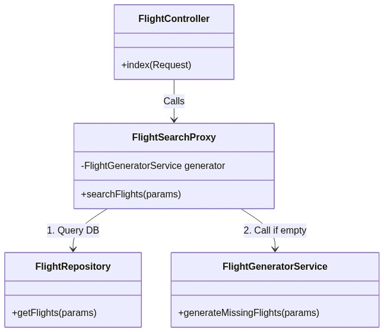
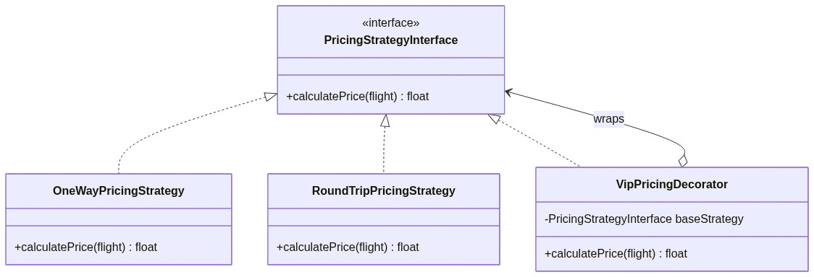
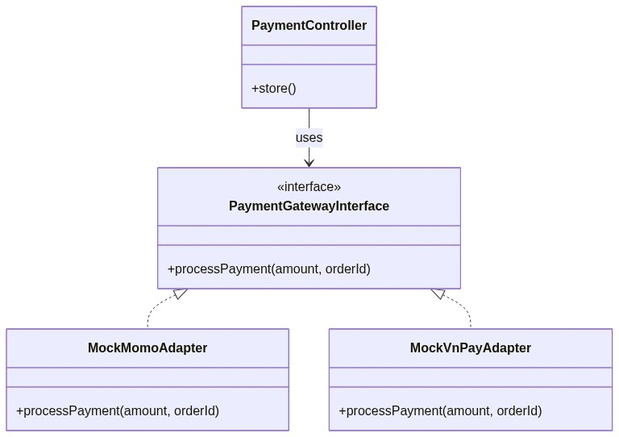
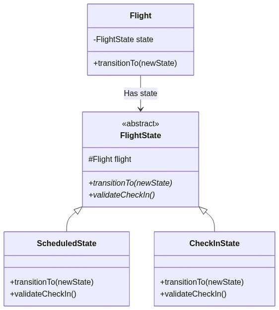
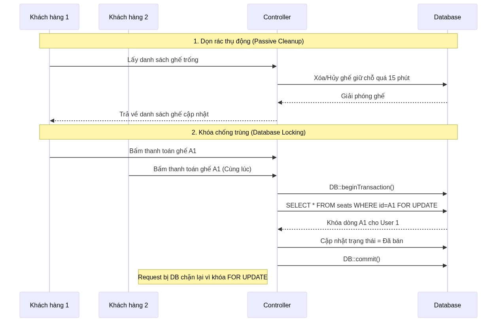

# BÁO CÁO CHUYÊN SÂU KIẾN TRÚC BACKEND & PHÂN TÍCH DESIGN PATTERNS
**Dự án:** SkyLink Airline System
**Thực hiện:** Phần lõi (Core Engine) xử lý đặt vé, tính giá và luồng bay.

---

## 1. TÌM KIẾM CHUYẾN BAY (Proxy & Factory Pattern)

### 1.1. Khái niệm
**Proxy Pattern** là một mẫu thiết kế cấu trúc (Structural Pattern) cung cấp một đối tượng trung gian (Proxy) để kiểm soát việc truy cập vào đối tượng thực. Trong dự án, `FlightSearchProxy` đóng vai trò đứng trước logic truy vấn Database thông thường. Nếu truy vấn không có kết quả, Proxy sẽ kích hoạt **Factory Pattern** (`FlightGeneratorService`) để tự động sinh ra chuyến bay mẫu, đảm bảo trải nghiệm người dùng không bao giờ bị gián đoạn vì "không tìm thấy dữ liệu".

### 1.2. Ưu điểm cốt lõi
| Ưu điểm | Giải thích chi tiết |
|---------|--------------------|
| **Single Responsibility (SRP)** | Controller chỉ làm nhiệm vụ tiếp nhận Request và trả về JSON, không ôm đồm logic kiểm tra Database hay sinh dữ liệu giả lập. |
| **Loose Coupling** | Controller không giao tiếp trực tiếp với DB hay Generator, mà chỉ giao tiếp với Proxy. Dễ dàng gắn thêm Redis Cache vào Proxy sau này. |
| **Deterministic Data** | Dữ liệu chuyến bay luôn được đảm bảo tồn tại, tạo ra luồng test (kiểm thử) mượt mà không bị tắc nghẽn ở bước tìm chuyến. |

### 1.3. Bảng so sánh trực quan (Trước và Sau Refactoring)
| Tiêu chí | Trước khi có Pattern (if/else trong Controller) | Sau khi dùng Proxy + Factory Pattern |
|----------|-------------------------------------------------|--------------------------------------|
| **Vị trí logic** | Dồn cục bộ trong hàm `index()` của `FlightController` | Tách bạch: `FlightSearchProxy` (Chắn cửa) và `FlightGeneratorService` (Sinh dữ liệu) |
| **Xử lý khi DB rỗng**| Phải viết `if ($flights->isEmpty()) { ... }` rất dài trong Controller | Proxy tự ngầm gọi Factory, Controller không cần biết. |
| **Bảo trì / Mở rộng** | Khó, dễ gây bug vỡ màn hình do Controller quá dài (Fat Controller) | Dễ, Controller siêu mỏng (Skinny Controller). |

### 1.4. Class Diagram

---

## 2. TÍNH TOÁN GIÁ VÉ ĐỘNG (Strategy & Decorator Pattern)

### 2.1. Khái niệm
- **Strategy Pattern** (Hành vi): Tách các công thức tính giá gốc (Một chiều, Khứ hồi) thành các class độc lập (`OneWayPricingStrategy`, `RoundTripPricingStrategy`).
- **Decorator Pattern** (Cấu trúc): Cho phép "bọc" (wrap) thêm các tính năng giảm giá (Ví dụ: Giảm giá VIP) lên trên Strategy gốc một cách linh hoạt trong thời gian chạy (runtime) mà không làm thay đổi code gốc.

### 2.2. Ưu điểm cốt lõi
| Ưu điểm | Giải thích chi tiết |
|---------|--------------------|
| **Open/Closed Principle (OCP)** | Muốn thêm loại giảm giá mới (Ví dụ: Giảm lễ Tết), chỉ cần tạo `HolidayPricingDecorator` mà không cần đụng vào code tính giá gốc. |
| **Tính kết hợp linh hoạt (Composable)** | Có thể lồng ghép nhiều lớp: Giá gốc -> Bọc bởi giảm VIP -> Bọc bởi mã Coupon. Không cần dùng lệnh `if...else` lồng nhau. |

### 2.3. Bảng so sánh trực quan
| Tiêu chí | Trước khi có Pattern | Sau khi dùng Strategy + Decorator |
|----------|----------------------|-----------------------------------|
| **Cấu trúc tính giá** | `if ($type == 'round_trip') {...} if ($is_vip) {...}` | Factory gọi Strategy, bọc thêm Decorator. |
| **Tuân thủ SOLID** | Vi phạm OCP. Sửa một lỗi có thể làm gãy các luật giảm giá khác. | Tuân thủ tuyệt đối OCP và SRP. |
| **Trùng lặp code** | Cao (phải lặp lại logic tính toán ở checkout và admin) | Không có (tất cả tập trung tại Pricing Service) |

### 2.4. Class Diagram

---

## 3. TÍCH HỢP THANH TOÁN (Adapter Pattern)

### 3.1. Khái niệm
**Adapter Pattern** là mẫu thiết kế cấu trúc giúp các interface không tương thích có thể làm việc cùng nhau. Momo và VNPay yêu cầu định dạng JSON đầu vào hoàn toàn khác biệt. Cấu trúc hệ thống sử dụng một `PaymentGatewayInterface` chuẩn hóa, và các `MockMomoAdapter` hoặc `MockVnPayAdapter` đóng vai trò "người phiên dịch", chuyển đổi dữ liệu chuẩn của hệ thống thành định dạng đặc thù của từng ví điện tử.

### 3.2. Ưu điểm cốt lõi
| Ưu điểm | Giải thích chi tiết |
|---------|--------------------|
| **Dependency Inversion** | Controller không bị ràng buộc (tight-coupling) với API của Momo. Controller chỉ giao tiếp với Interface. |
| **Bảo vệ Hệ thống** | Nếu tài liệu API của Momo bị thay đổi, ta chỉ cần sửa duy nhất file `MockMomoAdapter`, toàn bộ hệ thống đặt vé không bị ảnh hưởng. |

### 3.3. Bảng so sánh trực quan
| Tiêu chí | Khởi tạo API trực tiếp (Không Pattern) | Sử dụng Adapter Pattern |
|----------|-----------------------------------------|--------------------------|
| **Gọi API thanh toán** | Switch-case trực tiếp trong Controller, cURL thẳng tới Momo/VNPay. | Gọi `PaymentFactory::create()->processPayment()` |
| **Bảo trì / Thay đổi** | Phải dò tìm và sửa lại Controller thanh toán. Nguy cơ lỗi cao. | Cập nhật độc lập bên trong class Adapter. |

### 3.4. Class Diagram

---

## 4. VÒNG ĐỜI CHUYẾN BAY (State Pattern)

### 4.1. Khái niệm
**State Pattern** là mẫu thiết kế hành vi cho phép một đối tượng thay đổi hành vi của nó khi trạng thái nội bộ thay đổi. Máy bay có vòng đời cực kỳ nghiêm ngặt: `Scheduled` -> `Check-In` -> `Boarding` -> `Departed`. Hệ thống thay vì kiểm tra chuỗi `status`, đã chuyển hóa chúng thành các Object State riêng biệt (`CheckInState.php`, `ScheduledState.php`). 

### 4.2. Ưu điểm cốt lõi
| Ưu điểm | Giải thích chi tiết |
|---------|--------------------|
| **An toàn tuyệt đối** | Loại bỏ rủi ro do thao tác tay (ví dụ: máy bay đang cất cánh nhưng nhân viên ấn nhầm về Check-in). State class sẽ tự động chặn các bước nhảy cóc phi lý. |
| **Đóng gói Logic (Encapsulation)** | Mỗi class trạng thái tự chứa logic kiểm tra của riêng nó (ví dụ: giờ Check-in chỉ mở từ 24h-2h trước bay), không để lộn xộn trong Flight Model. |

### 4.3. Bảng so sánh trực quan
| Tiêu chí | Quản lý bằng biến String/Int | Quản lý bằng State Pattern |
|----------|------------------------------|----------------------------|
| **Kiểm tra trạng thái**| `if ($flight->status == 'scheduled' && $now > ...) `| `$flight->state()->validateCheckIn();` |
| **Chuyển đổi trạng thái**| Cập nhật thẳng thuộc tính `$flight->status = 'departed'` | Gọi qua hàm `$flight->state()->transitionTo('departed')` |

### 4.4. Class Diagram

---

## 5. QUẢN LÝ KHÓA GHẾ VÀ DỌN RÁC (Optimistic Locking & Passive Cleanup)

*(Lưu ý: Đây là Architectural & Database Pattern, không thuộc GoF Design Patterns truyền thống nhưng là phần đặc biệt quan trọng)*

### 5.1. Khái niệm
- **Optimistic Locking:** Sử dụng Transaction `DB::beginTransaction()` kết hợp `lockForUpdate()` khi hành khách bấm thanh toán. Row của chiếc ghế trong CSDL sẽ bị khóa chặn lại.
- **Passive Cleanup:** Thay vì cấu hình Job / Cronjob chạy ngầm liên tục gây hao tổn CPU server, hệ thống sẽ tự động dọn rác (xóa các ghế hết hạn giữ chỗ 15 phút) ngay tại khoảnh khắc có một hành khách mới thực hiện hành động tìm kiếm ghế.

### 5.2. Ưu điểm cốt lõi
| Ưu điểm | Giải thích chi tiết |
|---------|--------------------|
| **Loại trừ Race Condition** | Khắc phục 100% tình trạng hai khách hàng cùng bấm thanh toán 1 ghế tại cùng 1 giây (Double-booking). |
| **Tiết kiệm tài nguyên** | Cách tiếp cận Lazy Evaluation (Passive Cleanup) giúp máy chủ cực kỳ nhẹ, không cần worker chạy ngầm tốn chi phí. |

### 5.3. Sequence Diagram (Sơ đồ tuần tự)

---
**TỔNG KẾT:** Các kiến trúc và Pattern trên không chỉ giải quyết triệt để các bài toán hóc búa của nghiệp vụ Hàng Không (Tính đúng giá, chống trùng ghế, vòng đời nghiêm ngặt) mà còn tạo ra một bộ khung Code (Codebase) vững chắc, tuân thủ SOLID, sẵn sàng để nâng cấp mở rộng trong tương lai.
